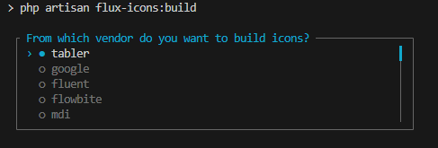

# Flux Icons

This is a laravel package to customize the icons for [Livewire Flux](https://github.com/livewire/flux). It builds the icons from various vendors into a `flux:icon` component.

## Installation

Generally you want to install this package only in your local development environment and build and publish the icons you need.

```cmd
composer require --dev ympact/flux-icons
```

## Icon Vendor Support

Initial support:

- [Tabler Icons](https://tabler.io/icons)
- [Flowbite](https://flowbite.com/icons/)
- [Fluent UI Icons](https://github.com/microsoft/fluentui-system-icons) - ([unofficial viewer](https://fluenticons.co/))
- [Google Material Design Icons](https://fonts.google.com/icons)
- [MDI](https://pictogrammers.com/library/mdi/)
- [Lucide](https://lucide.dev/icons/)
- [Bootstrap](https://icons.getbootstrap.com/#icons)
- [Codicons](https://github.com/microsoft/vscode-codicons/tree/main/src/icons) VScode codicons - no viewer

## Building icons

You will need to build the icons yourself once the package is installed. This can be done using the artisan command `flux-icons:build` you can optionally pass the vendor name as the first argument.

```cmd
php artisan flux-icons:build tabler --icons=confetti,confetti-off
```

In case you did not provide any arguments, the script will walk you through all options



### Options

| Option          | Description                                                                                        |
|-----------------|----------------------------------------------------------------------------------------------------|
| `--icons=`      | The icons to build (single or comma separated list). Cannot be used in combination with `--all`. |
| `-m\|--merge`   | Merge the icons listed in the `--icons` option with the icons defined in the config. Cannot be used in combination with `--all`. |
| `-a\|--all`     | Build all icons from the vendor. **Note:** this might generate over thousands of files and cause `npm run dev` to crash due to memory issues. |
| `-v\|--verbose` | Show additional messages during build. |

The artisan script will try to install the vendor's icon package using `npm install`.

### Usage

Since this package publishes all icons to `resources/views/flux/icon/{vendor}/` you can simply use the Blade convention of referencing the icons within your flux:icon component. So for example:

```html
<flux:icon.tabler.confetti />
or
<flux:icon name="tabler.confetti-off"/>
```

## Publish config

You can publish the config file to adjust settings for a specific vendor or add your own vendor. For exmaple adjusting the stroke width of outline icons.
In case you add your own vendor, please share or make a PR so others can use it too!

```cmd
php artisan vendor:publish --tag=config
```

### Publish specific vendor callbacks

Some vendors have callbacks defined (see the [config](/config/flux-icons.php). You can publish the class for these vendors using the following command:

```cmd
php artisan flux-icons:publish {vendor}
```

When adjusting the callback for an vendor, make sure you also publish the config file and reference the correct class.

## Advanced configuration

### General config

| Option     | Valaue     | Description                                                                 |
|------------|------------|-----------------------------------------------------------------------------|
| `icons`    |  `null` or `['vendorName' => ['icon-name', ...] ]` | A list of icons that will be build/updated by default in case no icons are passed to `flux-icons:build` command.  |
| `default_stroke_width` | `float` | For outline icons a default stroke width can be configured. The default Flux Heroicons uses a width of 1.5. |

### Vendor specific configuration

The vendor specific configuration sits within the `vendors` key. Each vendor should have a key. That key will be used as directory name when exporting the icons.

```php
'vendors' => [
    'tabler' => [
        'vendor' => 'Tabler',
        'namespace' => 'tabler',
        'package' => '@tabler/icons',
        'variants' => [ 
            //...
        ]
    ]
 ]
```

| Option     | Value     | Default  |Description                                                                 |
|------------|-----------|----------|----------------------------------------------------------------------------|
| `vendor`    | `string` |         | Human readable name of the vendor. |
| `namespace` | `string`  |         | The namespace for the Flux icon, in case omitted, the vendor name will be used. |
| `package`   | `string` |          | The npm package that should be installed to retrieve the icons. |
| `baseVariant` | `string` | `outline` | The default variant to use as basis. This is usually the vendor's variant that has the most icons available. |
| `variants`  | `array` |           | The configuration for each of the variants (outline, solid, mini, micro). |
| `attributes` | `[class, method]` | `null` | A callback to adjust the attributes on the SVG. |
| `transform` | `[class, method]` | `null` | A callback to transform the SVG path data. |
| `stroke_width`| `[class, method]` | `null` | A callback to determine the whether the stroke width should be changed on this icon. |

#### Variants

```php
    'variants' => [
        'outline' => [
            'source' => [], // see config options below
            'template' => 'outline',
            'fallback' => 'default', 
            'stroke_width' => false, 
            'size' => 24,
            'attributes' = []
        ],
        'solid' => [
            'source' => [],
        ],
        'mini' => [
            'base' => 'solid'
        ],
        'micro' => [
            'base' => 'solid'
        ],
    ]
```

| Option     | Value     | Default  |Description                                                                 |
|------------|-----------|----------|----------------------------------------------------------------------------|
| `source`   | `string\|callable array` |  | define the source directory. See the details [below](#source).      |
| `template` | `outline` or `solid` |  | The svg-tag template for the specific variant. Mini and micro variants use the solid template by default. Commonly the outline icon may be set to solid as the outline icon was designed as solids and not using strokes. |
| `fallback` | `string\|callable array` | | Determine the fallback icon to use if it the source was not found for the specific variant. See [details below](#fallbacks-for-icon-variants). |
| `stroke_width` | `int\|float` |   | Determine the stroke width for the icon. Works only in case the `outline` template is used |
| `size`     | `int`     | ... | Determine the size of the icon variant. By default we'll use the Flux implementaton (outline/solid = 24px, mini = 20px and micro = 16px |
| `attributes` | `array` | `[]` | Add or remove (null) specific attributes to the svg html tag of the icon. |
| `base`     | `string`  | `null`   | Determine what the base settings are for the `mini` and `micro` variants. By default the `solid` settings are used. |

#### Source

The source directories specify where the script can find the outline and solid versions of the icons you want to build.
In case the vendor uses a prefix or suffix for the icons, we want to configure it here to determine the basename of the icon and make them easier accessible in flux.

```php
[
    'dir' => 'node_modules/vendor/icons/...',
    'prefix' => null,
    'suffix' => null 
    'filter' => [ Ympact\FluxIcons\Services\Vendor\VendorName::class, 'filter']
]
```

##### Filter

An optional `filter` callback can be defined to indicate whether a file in the directory should be used as outline or solid respectively.
The function gets three arguments passed: `$file`, `$icons`, `$variant`:

- `$file` 
- `icons` is an array of icons that the user requested to build. This is passed by reference in case this array needs to be adjusted. See the [Mdi class](src/Services/Vendors/Mdi.php) as example.
- `$variant`

Optionally callbacks can be defined on `dir`, `prefix` and `suffix` to adjust these according to the icon variant. The `$variant` passed to the callback defines which variant is currently build (`outline`, `solid`, `mini`, `micro`).

```php
'solid' => [ 
    [
        'dir' => 'node_modules/vendor/icons/icons/filled', 
        'prefix' => null, 
        'suffix' => [ Ympact\FluxIcons\Services\Vendor\VendorName::class, 'sourceSolidSuffix']
    ],
],
```

#### Fallbacks for icon variants

Due to the way the flux icon component is made, it requires 4 variants: an outline and preferably a solid of three sizes:

- solid - 24px
- mini - 20px
- micro - 16px

Using the configuration of the vendor, you can determine how to handle the building of the icon when there is no source file for a certain variant. The options are

| Value     | Description                                                                |
|-----------|----------------------------------------------------------------------------|
| `false`   | No fallback is used, this will cause the entire icon not to be build.      |
| `default`  | Use the base variant (usually the `outline` icon). |
| `{variant}` | Any of the variants |
| `callback array` | A callback to determine that should return any of the options above. |

#### Callbacks

The configuration file provides various options on which callback can be defined. To keep the config file serializable, the callbacks should be defined in a separate class and referenced as above. See [vendor.php.stub](resources/stubs/vendor.php.stub) for reference of the available callbacks.

## Additional icons

This package also provide some custom icons that can be published:

They can be published using

```cmd
php artisan vendor:publish --tag=flux-icons-icons
```

- An empty icon, can be useful for simple logic in your blade or components:
  
  ```html
  <flux:icon name="{{ $icon ?? 'flux-icons.empty' }}" />
  ```

- A placeholder avatar icon, using an icon or initials

  ```html
  <flux:icon.flux-icons.avatar-placeholder name="Maurits Korse" color="green" />
  <flux:icon.flux-icons.avatar-placeholder icon color="green" />
  ```

  This icon has additional properties:
  - **icon** `(void|string)`: uses the Heroicon user icon as image.
  - **name** `(string)`: instead of an icon two initials of a name will be shown. You can pass the full name (Maurits Korse) or just the initials (MK)
  - **color** `(string)`: colorizing the icon using the same as Flux badges

## Roadmap

- Add/Improve command for updating/rebuilding icons
- Adding more vendors
- Helper script to create configurations for new vendors
- Improving testing
- Documentation
